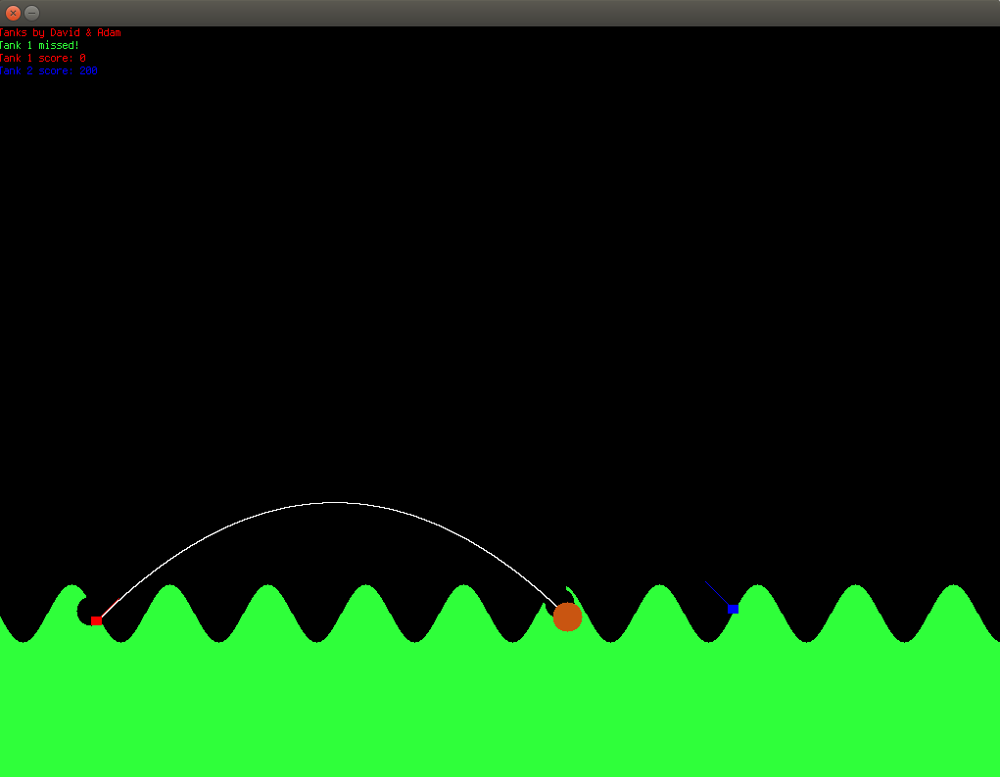

SimpleTanks
==========

# To run:

```
make
./tanks
````

# Controls:

Tank 1 / 2 controls:
a = move gun up
d = move gun down
w = increase gun power
s = decrease gun power
space = shoot

r = restart

# Sample image:

